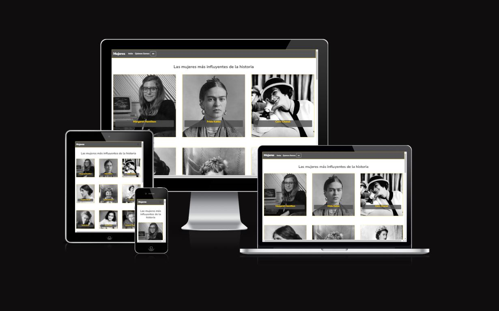

# Emulating FCBarcelona's

* Web structure
The main goal of this proyect was to aply in a simple way the structure of the following page: `https://www.fcbarcelona.es/es/futbol/primer-equipo/jugadores`

    In my case, I designed a simple home-page trying to emulate the structure of the cards that contained all the players and their effects.
    
* To get the project structure please go to: https://agustinaf-87.github.io/gist-repo/
* ngx-translate:
This library helps you to to implement multilingual support in an Angular application.The implementation is done through json translation files and translation pipes in HTML to achieve multilingual support: https://agustinaf-87.github.io/translate-explanation/

## Getting Started

These instructions will give you a copy of the project up and running on
your local machine.

### Prerequisites

Requirements:  
- clone the github repository  

### Installing    

Run the following script in order to install npm modules:  

    `npm install`

If you want to see the proyect in angular enviroment run the following: 

    ng serve --o

### Deployment

You can see the web deploy on vercel : https://fc-barcelona-structure.vercel.app/ 

## Authors

  - **Agustina Fernández** - 
    [GitHub](https://github.com/agustinaf-87)       

    
# Extra Information

This project was generated with [Angular CLI](https://github.com/angular/angular-cli) version 15.2.3.

## Development server

Run `ng serve` for a dev server. Navigate to `http://localhost:4200/`. The application will automatically reload if you change any of the source files.

## Build

Run `ng build` to build the project. The build artifacts will be stored in the `dist/` directory.

## Running unit tests

Run `ng test` to execute the unit tests via [Karma](https://karma-runner.github.io).

